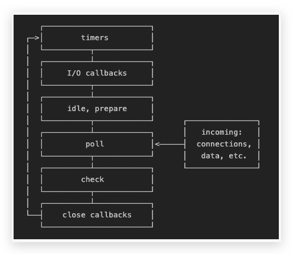

## 说一下 Liubv 的事件循环机制？

> 事件循环是 libuv 的核心，所有的 I/O 操作都建立在它之上。

NodeJs 最核心的两个部分：V8 引擎 和 Liubv ，V8 并不具备 I/O 操作的能力，而 Liubv 能够提供该能力。在 V8 层面发起对文件、网络等 I/O 操作，在事件循环（Liubv）中加入事件以及对应的回调处理，当 Liubv**完成当前任务**后，会调用注册的回调函数注入最终结果。

> Node.js 是单线程的，但 liubv 并不是单线程的，他依赖 Nodejs 启动时初始化的线程池

### 初始化事件生命周期

### 异步 I/O

#### 观察者

在每个事件循环过程中，内部是通过观察者对事件**是否完成**进行监控。因此在每个循环中会有一个或多个观察者，通过询问这些观察者，当前是否有要处理的事件。

浏览器也是采用了类似的机制，例如当用户点击时，这些事件的产生都有对应的观察者。在 Node 中，事件来源主要有文件 I/O 和网络请求等。因此这些观察者有对应的 文件 I/O 观察者、网络 I/O 观察者等。

#### 执行异步函数

以简单的 fs.open()为例，Node 在执行异步 I/O 调用时的流程如下：

XXX: 图

JavaScript 调用 Node 的核心模块，核心模块调用 C++内建模块，而后通过 libuv 进行对系统的调用。

在 Liubv 中，我们封装了一个叫做**请求对象**的中间层，这个请求对象会被推入到 liubv 中 依赖的**线程池**中。在线程中如果有可用的线程，会调用对应的方法去做对应的事儿，比如会进行系统层面的文件读取操作。

到这里 JS 异步操作的第一个阶段已完成可以去做后续的操作，不管在 I/O 线程池中是否阻塞，在 JS 层面都不会影响后面的操作，从而实现异步。

#### 执行回调函数

当线程池中 I/O 操作完毕后，会通知**事件循环**的**I/O 观察者**当前操作以完毕，并将请求对象加入到观察者的队列中，而后去做自己的事情。

当 I/O 观察者要执行回调时，会从请求对象身上获取**当时注册的事件回调处理函数**，并执行。从而达到**调用 JS 中传入的回调函数**。

整个流程如图所示：

这个周而复始的过程就是我理解的 Liubv 的事件循环，只不过还有很多种事件，例如非 I/O 的异步 API。

### 非 I/O 的异步 API
