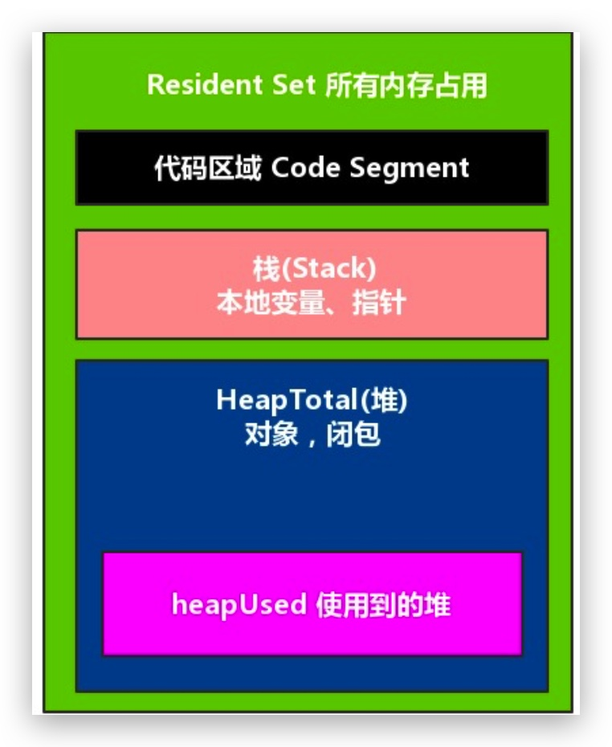

## 说一下垃圾回收策略？

- 回收策略
- 栈空间：ESP
- 堆空间：Scavenge、标记清除、标记整理
- 全停顿和增量标记
- NodeJs 垃圾回收

### 策略：手动/自动

垃圾数据回收分为**手动回收**和**自动回收**两种策略，C/C++ 就是使用手动回收策略，**何时分配内存、何时销毁内存都是由代码控制的**。

JavaScript、Java、Python 等语言属于自动垃圾回收的策略 ，**产生的垃圾数据是由垃圾回收器来释放的**，不需要手动释放。

> 堆内存中的数据和栈内存中的数据垃圾回收时采用的策略不同

### 栈中的垃圾数据

通过 ESP 指针来标识当前执行栈中执行的上下文，当 ESP 发生下移操作时，会销毁前一个的上下文。

当一个函数执行结束之后，**JavaScript 引擎会通过向下移动 ESP 来销毁该函数保存在栈中的执行上下文**。

### 堆中的垃圾数据

垃圾回收算法有很多种，但是并没有哪一种能胜任所有的场景，需要权衡各种场景，根据对象的生存周期的不同而使用不同的算法，以便达到最好的效果。

因此 V8 将堆分为**新生代**和**老生代**两个区域，**新生代中存放的是生存时间短的对象，老生代中存放的生存时间久的对象**。

新生代内存比老生代内存容量小很多，通常为 1~8MB，V8 分别使用如下垃圾回收器处理不同区域：

- **新生代：副垃圾回收器**
- **老生代：主垃圾回收器**

#### 回收器工作流程

**不论什么类型的垃圾回收器，它们都有一套共同的执行流程**。

1. 标记空间中还在使用的对象（活动对象），以及可以垃圾回收的对象（非活动对象）
2. 在标记完成后，统一清理内存中所有被标记为可回收的对象。
3. 整理内存碎片。频繁回收对象后，内存中就会存在大量不连续空间，我们把这些不连续的内存空间称为**内存碎片**。（副垃圾回收器不产生内存碎片）

#### 新生代

副垃圾回收器主要负责新生区的垃圾回收，该垃圾回收次数非常频繁（小的对象被分配到这里）

新生代中用**Scavenge 算法**来处理。所谓 Scavenge 算法，是把新生代空间对半划分为两个区域，一半是对象区域，一半是空闲区域，如下图所示：

新加入的对象都会存放到对象区域，当对象区域快被写满时，就需要执行一次垃圾清理操作。

1. 对 对象区域的垃圾做标记
2. 活动的对象复制到空闲区域并有序排列（内存整理，因此没有内存碎片），非活动对象直接清除掉。
3. 对象区域 和 空闲区域角色翻转 （因此理论上能够让新生代两块区域无限重复使用）
4. 对象晋升策略：经历两次的垃圾回收依然活动的对象，会被移入老生区。

> 由于新生代中采用的 Scavenge 算法，所以每次执行清理操作时，都需要将存活的对象从对象区域复制到空闲区域。**为了执行效率，一般新生区的空间会被设置得比较小**。

### 主垃圾回收器

除了新生区晋升的对象，一些大的对象会被分配到老生区。其特点：

- 对象占用空间大
- 对象存活时间长

因此不能选用 Scavenge 算法进行垃圾回收（容量大，频繁操作，效率低），因此垃圾回收器是采用**标记 - 清除** 的算法进行垃圾回收。

1. 标记阶段，遍历调用栈，如果能够还存在的对象则标记活动，否则判断为垃圾数据。
2. 清除垃圾数据

   

在该垃圾清理过程中会产生内存碎片，因此衍生出另外一种算法：**标记 - 整理**，这个标记过程仍然与 标记 - 清除 算法里的是一样的，但后续步骤不是直接对可回收对象进行清理，而是让所有存活的对象都向一端移动，然后直接清理掉端边界以外的内存。

### 全停顿与增量标记

JavaScript 是运行在主线程之上的，一旦执行垃圾回收算法，都需要将正在执行的 JavaScript 脚本暂停下来，待垃圾回收完毕后再恢复脚本执行。我们把这种行为叫做**全停顿（Stop-The-World）**。

因此在处理老生代区域时，很有可能会造成页面的卡顿现象。为了降低老生代的垃圾回收而造成的卡顿，V8 将标记过程分为一个个的子标记过程，同时让垃圾回收标记和 JavaScript 应用逻辑交替进行，直到标记阶段完成，我们把这个算法称为**增量标记（Incremental Marking）算法**。

通过拆分为不同小任务，穿插在 JavaScript 任务中间执行，解决页面卡顿现象。

### NodeJs 垃圾回收

在实际中开发时，几乎很少有人能遇到垃圾回收对应用程序性能的影响，但是在服务端，我们就能发现，对于性能敏感的服务端程序，内存管理的好坏，垃圾回收是否优良，都会影响着服务端程序，NodeJs 本身就是基于 V8，因此与 V8 的垃圾回收密不可分。

在 NodeJs 中可以通过查看 process.memoryUsage()返回的对象的信息：**Node 进程中内存占用的信息**

rss：所有内存使用，包括指令和堆栈
heapTotal：堆占用的内存，包括用到的，和准备回收的
heapUsed：用到的堆内存，可以通过该字段判断是否发生内存泄漏
external：V8 引擎中 C++对象占用的内存

### 打开新老内存限制

### 堆外内存

### 大内存对象使用 stream 模块
