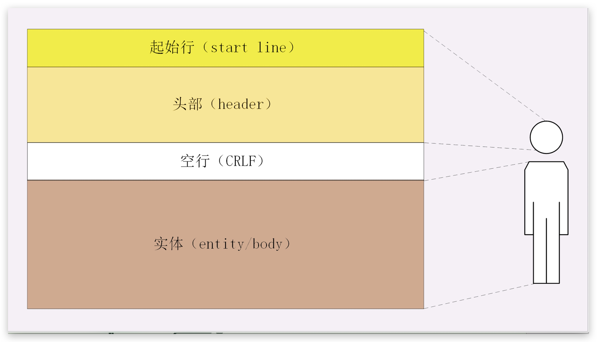
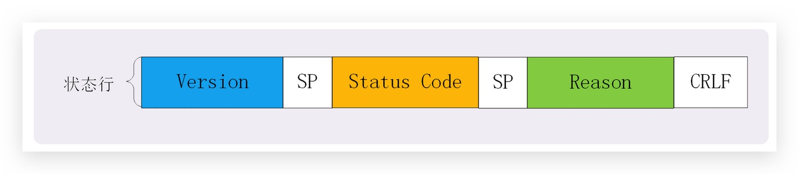

## 来描述一下 HTTP 报文结构

### 和 TCP 的关系

- 相同点：HTTP 协议也是与 TCP/UDP 类似,同样也需要在实际传输的数据前附加一些头数据
- 不同点：它是一个明文的协议,所以头数据都是 ASCII 码的文本（HTTP2 就不是了）

起始行（start line）：描述请求或响应的基本信息；
头部字段集合（header）：使用 key-value 形式更详细地说明报文；
消息正文（entity）：实际传输的数据，它不一定是纯文本，可以是图片、视频等二进制数据。

### 起始行

1. 请求行
   

- 请求方法(是一个动词，如 GET/POST，表示对资源的操作)
- 请求目标 URI(通常是一个 URI，标记了请求方法要操作的资源)
- 协议版本号

2. 状态行
   

> 在这里它不叫“响应行”,而是叫“状态行”(status line),意思是服务器响应的状态。

- 协议版本号
- 状态码(一个三位数，用代码的形式表示处理的结果，比如 200 是成功，500 是服务器错误)
- 短语(作为数字状态码补充，是更详细的解释文字，帮助人理解原因)

### 常用头字段

**1. 通用字段**

- Date(通常出现在响应头里,表示 HTTP 报文创建的时间,客户端可以使用这个时间再搭配其他字段决定缓存策略)
- Cache-Control
- Connection (连接管理)
- via（代理服务器）

**2. 请求字段（仅能出现在请求头里,进一步说明请求信息或者额外的附加条件）**

- Host（只能出现在请求头里,它同时也是唯一一个 HTTP/1.1 规范里要求必须出现的字段,也就是说,如果请求头里没有 Host,那这就是一个错误的报文。）

> Host 字段告诉服务器这个请求应该由哪个主机来处理,当一台计算机上托管了多个虚拟主机的时候,服务器端就需要用 Host 字段来选择,有点像是一个简单的“路由重定向”。

- User-Agent(它使用一个字符串来描述发起 HTTP 请求的客户端,服务器可以依据它来返回最合适此浏览器显示的页面。)

> 但由于历史的原因,User-Agent 非常混乱,每个浏览器都自称是“Mozilla”“Chrome”“Safari”,企图使用这个字段来互相“伪装”,导致 User-Agent 变得越来越长,最终变得毫无意义。

> 不过有的比较“诚实”的爬虫会在 User-Agent 里用“spider”标明自己是爬虫,所以可以利用这个字段实现简单的反爬虫策略。

- 内容协商系
  - Accept
  - ~Charset
  - ~Encoding
  - ~Language
- 协商缓存类 - if-Modified-since - if-None-Match
- range

**3. 响应字段（仅能出现在响应头里,补充说明响应报文的信息）**

- Server 字段

> Server 字段也不是必须要出现的,因为这会把服务器的一部分信息暴露给外界,如果这个版本恰好存在 bug,那么黑客就有可能利用 bug 攻陷服务器。所以,有的网站响应头里要么没有这个字段,要么就给出一个完全无关的描述信息。

- 重定向：locaction
- Etag
  > 弱 Etag 需要加上 W/

**4. 实体字段（它实际上属于通用字段,但专门描述 body 的额外信息）**

- 内容协商类 - Content-Length

> 它表示报文里 body 的长度,也就是请求头或响应头空行后面数据的长度。服务器看到这个字段,就知道了后续有多少数据,可以直接接收。如果没有这个字段,那么 body 就是不定长的, 需要使用 chunked 方式分段传输。

- 缓存时效类 - expires - Last-Modified
