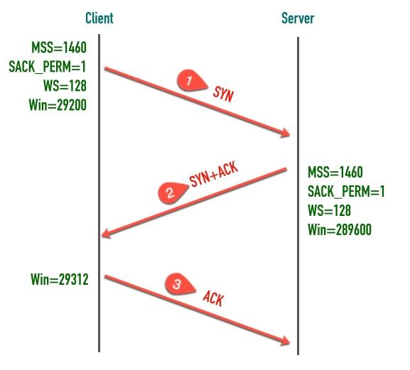

## 说说TCP三次握手吧

### 交换彼此的初始序列号

三次握手的最重要的是**交换彼此的 ISN（初始序列号）**

1、客户端发送 SYN 报文，这个报文只有 SYN 标记被置位。
> SYN 报文不携带数据，但是它占用一个序号，下次发送数据序列号要加一。客户端会随机选择一个数字作为初始序列号（ISN）
> 凡是消耗序列号的 TCP 报文段，一定需要对端确认。如果这个段没有收到确认，会一直重传直到达到指定的次数为止。 

2、服务端收到客户端的 SYN 段以后，将 SYN 和 ACK 标记都置位
> SYN 标记的作用与步骤 1 中的一样，也是同步服务端生成的初始序列号。

3、客户端发送三次握手最后一个 ACK 段，这个 ACK 段用来确认收到了服务端发送的 SYN 段。因为这个 ACK 段不携带任何数据，且不需要再被确认，这个 ACK 段不消耗任何序列号。

### 交换辅助信息

除了交换彼此的初始序列号，三次握手的另一个重要作用是**交换一些辅助信息**，比如最大段大小（MSS）、窗口大小（Win）、窗口缩放因子（WS)等。

